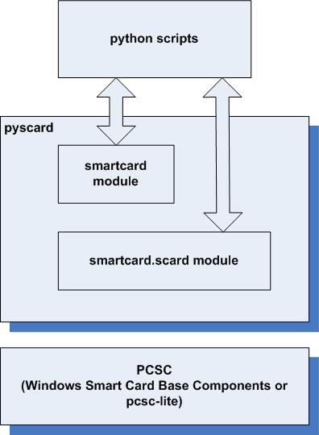

# Documentation technique

## Rappel du cahier des charges

### Introduction
Dans le cadre du 2ème travail de semestre, j'ai décidé d'effectuer un projet qui me sera très utile pour le travail de diplôme. L'idée serait de faire une application en python qui récupère des données d'entrainement avec l'API Polar en fonction de la carte RFID qui est détécté.

#### But du projet
Le but de ce projet est de me préparer au maximum pour le travail de diplôme. C'est pour cela que j'ai décidé de mettre ensemble 2 technologies que je n'ai pas encore beaucoup utilisé et qui sont essentielles pour mon travail de diplôme.
#### Contraintes techniques
Je dois utiliser un lecteur de carte à puce et l'API Polar Accesslink pour récupérer les données d'entrainements.

### Analyse

#### Technologies 
* Python
* Markdown
* Github (versionning, task manager)
* Ordinateur de type PC, 2 écrans
* Visual Studio Code
* Mkdocs (Documentation)
* NFC Reader ACR122U

##### NFC Reader ACR122U


Le lecteur NFC ACR122U est un appareil permettant de lire et d'écrire sur des cartes sans contact. Il est basé sur la technologie Mifare 13,56 MHz (RFID) et suit les standard de la norme ISO 18092. L'ACR122U est développé et vendu par ACS ltd .

Pour pouvoir utiliser ce lecteur, j'ai utilisé la librairie *pyscard* qui me permet de récupérer les infos des cartes à puces que le lecteur lit


##### Pyscard - Librairie Python Smart card 

Pyscard est un module python qui permet d'utiliser les carte à puce (PC/SC) avec python. Il donne accès à plusieurs classes et fonctions donnant accès aux cartes et aux lecteurs.  



Architecture pyscard :

* smartcard.scard est un module d'extension enveloppant l'API WinSCard (Les composants de base smartcard) aussi connue sous le nom PC/SC (Personal computer / Smart Card)
* smartcard est un framework Python construit à partir de l'API PC/SC

##### Polar Accesslink API 


Accesslink est une API qui donne accès aux données d'entrainement et d'activitée journalière enregistrés par les appareils Polar. Pour pouvoir l'utiliser il est nécessaire de posséder un compte Polar Flow afin de créer un client sur [admin.polaraccesslink.com](admin.polaraccesslink.com) qui nous donnera accès à l'API. 

Accesslink utilise [OAuth2](https://oauth.net/) comme protocole d'authentification. Les utilisateurs enregistrés ont besoin de s'authentifier pour pouvoir avoir accès aux données.

Fonctionnalités de base d'Accesslink :

| Fonctionnalité        | Description                                            |
| ----------------------| ------------------------------------------------------ |
| Utilisateurs          | Permets d'enregistrer, supprimer et récupérer les informations de base de l'utilisateur        |       
| Pull Notification     | Permets de vérifier si l'utilisateur à des données disponible à récupérer | 
| Donnée d'entrainement | Permets d'accéder aux données d'entrainements de l'utilisateur |
| Activité journalière  | Permets d'accéder aux données de l'activité journalière de l'utilisateur |
| Info physique         | Permets d'accéder aux informations physique de l'utilisateur (Ex: Taille/Poids) |
| Modèle de données     | Décrit tous les objets qui transportent les données entre le serveur et le client |
| Annexes               | Contients des exemples et des détails sur l'interface de l'application |    

#### Environnement de développement
Afin de développer mon application, j'ai choisi d'utiliser [VNC Viewer](https://www.realvnc.com/fr/connect/download/viewer/) en premier lieu pour me permettre d'avoir accès au CrowPi depuis Windows. Ensuite, j'ai choisi d'utiliser l'extension [VsCode Remote-SSH](https://code.visualstudio.com/docs/remote/ssh) pour me connecter en SSH au CrowPi et ainsi manipuler les fichier directement depuis VSCode
#### Modèle de données

## Analyse fonctionnelle

### Interface

### Fonctionnalités

## Analyse organique
### Architecture
#### Arborescence de fichier
```
+-- docs
|	+-- documentation.md
|	+-- logbook.md
+-- mkdocs.yml
```

## Tests

## Conclusion