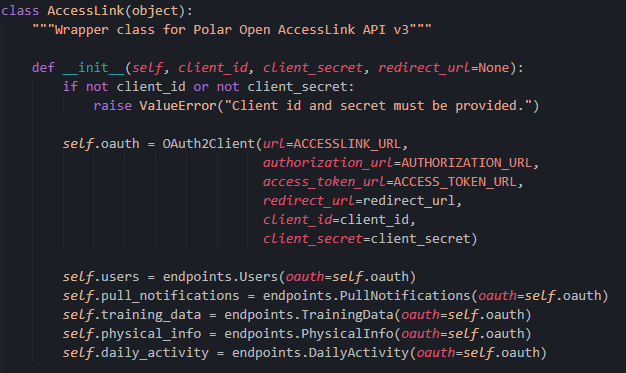
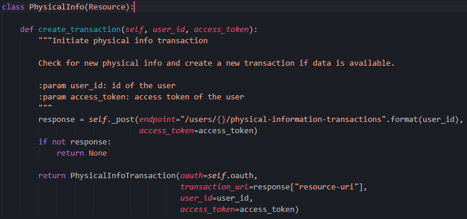
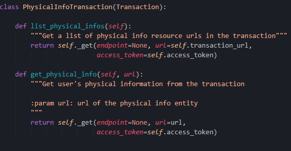
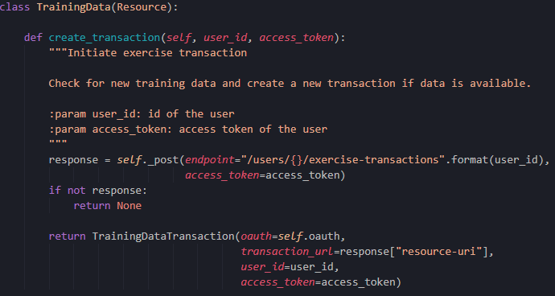

# Documentation technique

## Rappel du cahier des charges

### Introduction
Dans le cadre du 2ème travail de semestre, j'ai décidé d'effectuer un projet qui me sera très utile pour le travail de diplôme. L'idée serait de faire une application en python qui récupère des données d'entrainement avec l'API Polar en fonction de la carte RFID qui est détecté.

#### But du projet
Le but de ce projet est de me préparer au maximum pour le travail de diplôme. C'est pour cela que j'ai décidé de mettre ensemble 2 technologies que je n'ai pas encore beaucoup utilisé et qui sont essentielles pour mon travail de diplôme. 

Pour ce projet, uniquement les scripts python permettant de traiter les données voulues seront effectués. La partie interface de l'application finale est réalisée dans le cadre d'un autre cours.
#### Contraintes techniques
Je dois utiliser un lecteur de carte à puce et l'API Polar Accesslink pour récupérer les données d'entrainements.

### Analyse

#### Technologies 
* Python
* Markdown
* Github (versionning, task manager)
* Ordinateur de type PC, 2 écrans
* Visual Studio Code
* Mkdocs (Documentation)
* NFC Reader ACR122U
* Polar Accesslink API

<DIV STYLE="page-break-before:always"></DIV>

##### NFC Reader ACR122U

Le lecteur NFC ACR122U est un appareil permettant de lire et d'écrire sur des cartes sans contact. Il est basé sur la technologie Mifare 13,56 MHz (RFID) et suit les standards de la norme ISO 18092. L'ACR122U est développé et vendu par ACS ltd .

Pour pouvoir utiliser ce lecteur, j'ai utilisé la librairie *pyscard* qui me permet de récupérer les infos des cartes à puces que le lecteur lit

{ width="300" }

###### RFID
**Qu'est-ce que la technologie RFID ??**
 
RFID (Radio Frequency Identification), est une technologie qui permet d'enregistrer des données sur un support et de les récupérer à distance. Elle est apparue dans les années 1940 et était utilisée uniquement par l'armée pour l'identification des avions de guerre qui entrait dans l'espace aérien du Royaume-Uni. Elle s'est ensuite répandue dans différents secteurs industriels à partir des années 1980.
  
**Comment fonctionne la RFID ?**

Les étiquettes RFID, sont composées d'une puce RFID et d'une antenne et sont collées sur un produit. Elles enregistrent les données et avec un lecteur électromagnétique on peut ensuite lire les ondes radio présentes sur la puce RFID grâce à l'antenne.
 
**Pourquoi utiliser RFID**

RFID est un système de traçabilité. A l'aide d'une seule puce, il est possible de tracer les produits pendant tout le processus de production, de transport et de distribution, voire même jusqu'à leur fin de vie.

Dans le cadre de mon projet, RFID est une solution adéquate pour gérer les entrées/sorties des clients dans la salle d'entrainement.

<DIV STYLE="page-break-before:always"></DIV>

**Différences entre RFID et NFC**

{ width="500"}

Dans le cadre de mon projet, j'utilise parfois le terme NFC. La technologie NFC (Near Field Communication) est un dérivé de la RFID qui a commencé à être utilisé dès 2011. Le NFC repose sur le même concept que la RFID. C'est une technologie qui fonctionne avec une puce permettant d'échanger des données entre un lecteur et n'importe quel terminal avec un simple rapprochement ou contact entre les deux objets.

La communication sans fil ne fonctionne qu'à courte portée et haute fréquence, une distance d'environ 10cm. La technologie NFC se retrouve dans la plupart des smartphones, consoles de jeux ou cartes bancaires. Le lecteur de carte que j'utilise fonctionne à l'aide de cette technologie également.

Les principales différences entre RFID et NFC résident dans la portée plus courte et sécurisée pour NFC (10cm) contre jusqu'à 10m pour RFID. La technologie NFC peut transmettre toute sorte de données contre RFID qui ne transmet que l'ID. La lecture fait, quant à elle, défaut à la technologie NFC qui ne peut lire qu'une puce à la fois ce qui peut limiter ses cas d'utilisation.


##### Pyscard - Librairie Python Smart card 

Pyscard est un module python qui permet d'utiliser les cartes à puce (PC/SC) avec python. Il donne accès à plusieurs classes et fonctions donnant accès aux cartes et aux lecteurs.  

{width="250"}

Architecture pyscard :

* smartcard.scard est un module d'extension enveloppant l'API WinSCard (Les composants de base smartcard) aussi connue sous le nom PC/SC (Personal computer / Smart Card)
* smartcard est un framework Python construit à partir de l'API PC/SC

###### Installation
Pour installer la librairie **pyscard** sur Windows 10, il faut au préalable installer [SWIG](http://www.swig.org/) et l'ajouter directement au PATH. Il faut ensuite installer Visual C++ version 14.0 ou plus récente (directement installable depuis le Visual Studio Installer).


##### SWIG


SWIG est un outil logiciel open source qui permet de connecter des logiciels ou librairies écrites en C/C++ avec des langages de scripts tels que : *Perl*, *Python*, *Ruby*, *PHP* ou d'autres langages de programmation comme *Java* ou *C#*.


##### Polar Accesslink API 


Accesslink est une API qui donne accès aux données d'entrainement et d'activitée journalière enregistrés par les appareils Polar. Pour pouvoir l'utiliser il est nécessaire de posséder un compte Polar Flow afin de créer un client sur [admin.polaraccesslink.com](admin.polaraccesslink.com) qui nous donnera accès à l'API. 

Accesslink utilise [OAuth2](https://oauth.net/) comme protocole d'authentification. Les utilisateurs enregistrés ont besoin de s'authentifier pour pouvoir avoir accès aux données.

Fonctionnalités de base d'Accesslink :

| Fonctionnalité        | Description                                            |
| ----------------------| ------------------------------------------------------ |
| Utilisateurs          | Permets d'enregistrer, supprimer et récupérer les informations de base de l'utilisateur        |       
| Pull Notification     | Permets de vérifier si l'utilisateur à des données disponible à récupérer | 
| Donnée d'entrainement | Permets d'accéder aux données d'entrainements de l'utilisateur |
| Activité journalière  | Permets d'accéder aux données de l'activité journalière de l'utilisateur |
| Info physique         | Permets d'accéder aux informations physique de l'utilisateur (Ex: Taille/Poids) |
| Modèle de données     | Décrit tous les objets qui transportent les données entre le serveur et le client |
| Annexes               | Contient des exemples et des détails sur l'interface de l'application |    

#### Environnement de développement
Pour l'environnement de développement, j'ai utilisé Visual Studio Code.

## Analyse fonctionnelle

### Interface
La partie réalisée lors du travail de semestre ne possède pas d'interface. Le programme récupère et sauve certaines données mais n'affiche rien. La partie "Affichage" de mon projet a été réalisé dans le projet du cours PDA.
### Fonctionnalités

#### Inscription
Lors de l'inscription d'un nouveau client, il remplit un formulaire, puis une fois le formulaire remplit le coach doit scanner une carte RFID. Le lecteur va lire la carte et l'ID de la carte sera attribué au compte client du nouvel inscrit.
#### Authentification
L'application permet de s'authentifier à l'aide du lecteur et d'une carte RFID. L'ID de la carte est enregistré dans la base de données. Si l'authentification est réussite, l'utilisateur peut utiliser une montre Polar pour son entrainement. A la fin de l'entrainement, le client scanne sa carte RFID avant de partir. Si la carte est reconnue, l'application va chercher les dernières données d'entrainement disponible à l'aide de l'API Polar AccessLink.

#### Enregistrement
Lorsque des données d'entrainement sont récupérés suite à la séance d'un client, elles sont automatiquement enregistrées dans la base de données et relié directement au client concerné.

#### Cas d'utilisation 
A l'arrivée d'un nouveau client, il doit s'inscrire via un formulaire. Une fois le formulaire renseigné, le coach doit scanner une nouvelle carte RFID à l'aide du lecteur. La carte sera enregistrée avec le compte du nouveau client en base de données.

Lorsqu'un client vient s'entrainer il doit s'authentifier à l'entrée à l'aide de sa "carte de membre" (la carte RFID remise lors de l'inscription). Une fois entré, le client peut se munir d'une des montres Polar misent à disposition pour son entrainement.

A la fin de son entrainement, juste avant de partir, le client badge à la sortie avec sa carte. Si la carte est reconnue, les dernières données d'entrainements sont récupérées à l'aide de l'API Polar. Toutes les données voulues sont enregistrées dans la base de données et sont reliés directement au client concerné.


## Analyse organique
### Architecture
#### Arborescence de fichier

##### documentation.md
Fichier Markdown contenant la documentation technique du projet.

##### logbook.md 
Fichier Markdown contenant le résumé journalier du travail effectué.


##### authorization.py
Script python qui permet d'authentifier un compte Polar pour avoir accès à l'API 


*Token généré avec l'id de l'utilisateur, on essaye ensuite de l'enregistrer avec l'API accesslink pour avoir accès aux données*


<DIV STYLE="page-break-before:always"></DIV>

##### acesslink.py 
Objet python qui enveloppe toutes les fonctionnalitées de l'API Polar



Pour chaque demande effectuable avec l'API (pour le retour de différente donnée) un objet a été créé. L'objet *Accesslink* récupère les données avec tous les endpoints qui permettent les transactions avec l'API.

##### endpoints/daily_activity.py
Objet qui permet de récupérer toutes les données concernant l'activitée journalière


##### endpoints/daily_activity_transaction.py
Objet pour l'activitée journalière qui effectue les demandes à l'API pour récupérer les données souhaitées.


<DIV STYLE="page-break-before:always"></DIV>

##### endpoints/physical_info.py
Objet qui permet de récupérer toutes les données concernant les informations physiques



##### endpoints/physical_info_transaction.py
Objet pour les informations physiques qui effectue les demandes à l'API pour récupérer les données souhaitées.



<DIV STYLE="page-break-before:always"></DIV>

##### endpoints/training_data.py
Objet qui permet de récupérer toutes les données concernant les données d'entrainements



<DIV STYLE="page-break-before:always"></DIV>

##### endpoints/training_data_transaction.py
Objet pour les données d'entrainements qui effectue les demandes à l'API pour récupérer les données souhaitées.


##### endpoints/pull_notifications
Objet qui permet de récupérer la liste des données disponibles.


##### endpoints/transactions.py
Objet qui permet de commit une transaction avec l'API.


<DIV STYLE="page-break-before:always"></DIV>

##### read.py
Script python qui permet de lire les données sur une carte RFID


##### config.yml
Fichier YAML contenant la configuration du client pour avoir accès aux données avec l'API Polar. Il Contient :
 
* L'id de l'utilisateur 
* L'id du client (Pour l'accès)
* Le secret du client 
* Le token d'accès (Il est généré avec le fichier authorization.py)

##### requirements.txt
Fichier contenant toutes les librairies/modules nécessaires pour le lancement de l'application. Pour l'utilisation :
```
pip install -r requirements.txt
```


## Conclusion
### Améliorations possibles
Dans le cadre du travail de semestre, j'ai totalement dissocié la partie donnée avec l'utilisation de l'API Polar et du lecteur RFID de l'interface graphique. L'interface graphique permet de relier tous les différents scripts que j'ai fait pour en faire une application fonctionnelle. La partie interface a été faite dans le cadre du cours PDA, il faudrait donc mettre ces 2 parties ensembles.

Une autre amélioration à explorer serait d'ouvrir l'application à tous les types de montres connectés. Pour le moment uniquement les montres Polar sont acceptées (à cause de l'utilisation de l'API Polar). 

Il faudrait également regarder pour avoir la possibilité d'utiliser la montre du client et pas une montre mise à disposition par le coach comme c'est le cas pour l'instant.


### Bilan personnel
Ce projet a été très bénéfique pour moi, je n'avais encore jamais utilisé l'API Polar ou encore un lecteur NFC. J'ai rencontré pas mal de problème et ça m'a permis de préparer pas mal de point pour mon travail de diplôme. J'ai trouvé très intéressant de travailler sur ces points car ils sont essentiels pour mon travail de diplôme et j'espère vraiment pouvoir avoir quelque chose de fonctionnel à la fin.
